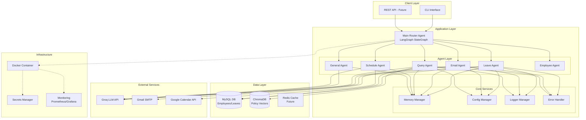

# Design Document: Production-Ready Restructuring for NovaHR

## Overview

This design transforms the NovaHR HR Assistant from a working prototype with 12+ Python files in the root directory into a production-ready application with proper structure, error handling, configuration management, security, monitoring, and deployment capabilities. The restructuring maintains all existing functionality while introducing enterprise-grade patterns for scalability, maintainability, and operational excellence.

**Key Goals:**
- Zero breaking changes to agent behavior and LangGraph workflows
- Backward compatible with existing MySQL database schema
- Environment-based configuration (dev/staging/prod)
- Comprehensive error handling and structured logging
- Production security practices (secrets management, input validation)
- Docker containerization with health checks
- CI/CD pipeline integration
- Monitoring and observability hooks

## Architecture

### High-Level System Architecture



### Data Flow Sequence

```mermaid
sequenceDiagram
    participant User
    participant Router
    participant Agent
    participant Service
    participant DB
    participant External
    participant Logger
    participant Monitor
    
    User->>Router: User Input
    Router->>Logger: Log Request
    Router->>Monitor: Increment Request Counter
    
    Router->>Router: Detect Intent
    Router->>Agent: Route to Agent
    
    Agent->>Logger: Log Agent Start
    Agent->>Service: Load Config
    Agent->>Service: Get Memory
    
    Agent->>DB: Query Data
    DB-->>Agent: Return Data
    
    Agent->>External: API Call (with retry)
    External-->>Agent: Response
    
    Agent->>Service: Update Memory
    Agent->>Logger: Log Agent Complete
    Agent->>Monitor: Record Metrics
    
    Agent-->>Router: Return State
    Router-->>User: Response
    Router->>Logger: Log Response
