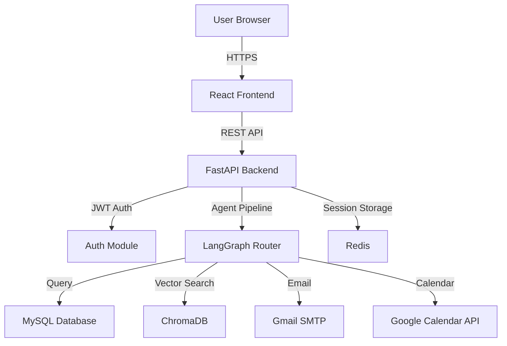

# NovaHR Project - Deep Analysis & Improvement Recommendations

> **Analysis Date:** May 4, 2026  
> **Project Status:** Production-Ready with Recommended Improvements  
> **Overall Grade:** B+ (85/100)

---

## Executive Summary

NovaHR is a well-structured AI-powered HR assistant with a clean architecture, proper authentication, and functional frontend. The project demonstrates good practices in code organization, security basics, and user experience. However, there are opportunities for improvement in error handling, testing, deployment readiness, and production hardening.

**Strengths:**
- ✅ Clean modular architecture
- ✅ JWT authentication with bcrypt
- ✅ Role-based access control
- ✅ Comprehensive documentation
- ✅ Functional React frontend with good UX

**Areas for Improvement:**
- ⚠️ Limited error handling and logging
- ⚠️ No automated tests
- ⚠️ In-memory session storage (not scalable)
- ⚠️ Missing production deployment configuration
- ⚠️ No rate limiting or API protection

---

## Detailed Analysis by Category

### 1. 🏗 Architecture & Code Organization

**Score: 9/10**

**Strengths:**
- Excellent separation of concerns (API, agents, tools, frontend)
- LangGraph-based agent routing is clean and maintainable
- Proper use of dependency injection in FastAPI
- Clear folder structure with logical grouping

**Issues:**
```
MINOR: Some circular import risks in auth modules
MINOR: Agent executors could be more modular
```

**Recommendations:**

**Priority: LOW**
- Consider extracting common agent patterns into base classes
- Add type hints consistently across all Python files
- Create a shared utilities module for common functions

---

### 2. 🔐 Security

**Score: 7/10**

**Strengths:**
- JWT tokens with proper expiry (8 hours)
- bcrypt password hashing (secure)
- Role-based access control enforced at API level
- Environment variables for sensitive data

**Critical Issues:**
```python
# api/main.py - Line 47
allow_origins=["*"]  # ❌ SECURITY RISK: Allows any origin
```

**Recommendations:**

**Priority: HIGH** 🔴
1. **Fix CORS Configuration**
```python
# api/main.py
app.add_middleware(
    CORSMiddleware,
    allow_origins=[
        "http://localhost:3000",  # Development
        "https://yourdomain.com"  # Production
    ],
    allow_credentials=True,
    allow_methods=["GET", "POST", "PUT", "DELETE"],
    allow_headers=["Authorization", "Content-Type"],
)
```

2. **Add Rate Limiting**
```bash
pip install slowapi
```
```python
# api/main.py
from slowapi import Limiter, _rate_limit_exceeded_handler
from slowapi.util import get_remote_address
from slowapi.errors import RateLimitExceeded

limiter = Limiter(key_func=get_remote_address)
app.state.limiter = limiter
app.add_exception_handler(RateLimitExceeded, _rate_limit_exceeded_handler)

# Apply to endpoints
@router.post("/chat")
@limiter.limit("30/minute")  # 30 requests per minute
async def chat(request: Request, ...):
    ...
```

3. **Add Input Validation**
```python
# api/models.py
from pydantic import BaseModel, Field, validator

class ChatRequest(BaseModel):
    message: str = Field(..., min_length=1, max_length=2000)
    session_id: str = Field(..., regex=r'^[a-zA-Z0-9\-_]+$')
    
    @validator('message')
    def sanitize_message(cls, v):
        # Prevent SQL injection attempts in message
        dangerous_patterns = ['DROP', 'DELETE', 'UPDATE', 'INSERT']
        if any(pattern in v.upper() for pattern in dangerous_patterns):
            raise ValueError('Invalid message content')
        return v.strip()
```

4. **Secure SECRET_KEY Generation**
```python
# Add to SETUP_GUIDE.md
import secrets
print(secrets.token_urlsafe(32))  # Generate secure key
```

**Priority: MEDIUM** 🟡
5. **Add HTTPS Enforcement** (for production)
6. **Implement password complexity requirements**
7. **Add account lockout after failed login attempts**
8. **Add CSRF protection for state-changing operations**

---

### 3. 🐛 Error Handling & Logging

**Score: 5/10**

**Critical Issues:**
```python
# src/tools/db_connection.py - Line 58
except Error as e:
    print(f"DB Query Error: {e}")  # ❌ Only prints to console
    return None  # ❌ Silent failure
```

```python
# api/routers/chat.py - Line 67
except Exception as e:
    raise HTTPException(
        status_code=500,
        detail=f"Agent processing failed: {str(e)}"  # ❌ Exposes internal errors
    )
```

**Recommendations:**

**Priority: HIGH** 🔴
1. **Implement Structured Logging**
```bash
pip install python-json-logger
```

```python
# src/utils/logger.py (NEW FILE)
import logging
from pythonjsonlogger import jsonlogger

def setup_logger(name: str) -> logging.Logger:
    logger = logging.getLogger(name)
    handler = logging.StreamHandler()
    
    formatter = jsonlogger.JsonFormatter(
        '%(asctime)s %(name)s %(levelname)s %(message)s'
    )
    handler.setFormatter(formatter)
    logger.addHandler(handler)
    logger.setLevel(logging.INFO)
    
    return logger

# Usage in db_connection.py
from src.utils.logger import setup_logger
logger = setup_logger(__name__)

def execute_query(self, query, params=None):
    try:
        # ... existing code ...
    except Error as e:
        logger.error(
            "Database query failed",
            extra={
                "query": query[:100],  # First 100 chars
                "error": str(e),
                "params": params
            }
        )
        raise DatabaseError("Query execution failed") from e
```

2. **Create Custom Exception Classes**
```python
# src/utils/exceptions.py (NEW FILE)
class NovaHRException(Exception):
    """Base exception for NovaHR"""
    pass

class DatabaseError(NovaHRException):
    """Database operation failed"""
    pass

class AuthenticationError(NovaHRException):
    """Authentication failed"""
    pass

class AgentProcessingError(NovaHRException):
    """Agent pipeline failed"""
    pass
```

3. **Add Global Exception Handler**
```python
# api/main.py
from fastapi import Request
from fastapi.responses import JSONResponse

@app.exception_handler(Exception)
async def global_exception_handler(request: Request, exc: Exception):
    logger.error(
        "Unhandled exception",
        extra={
            "path": request.url.path,
            "method": request.method,
            "error": str(exc)
        }
    )
    
    # Don't expose internal errors to users
    return JSONResponse(
        status_code=500,
        content={
            "detail": "An internal error occurred. Please try again later.",
            "error_id": str(uuid.uuid4())  # For support tracking
        }
    )
```

4. **Add Request/Response Logging Middleware**
```python
# api/middleware/logging.py (NEW FILE)
import time
from fastapi import Request

@app.middleware("http")
async def log_requests(request: Request, call_next):
    start_time = time.time()
    
    response = await call_next(request)
    
    duration = time.time() - start_time
    logger.info(
        "Request completed",
        extra={
            "method": request.method,
            "path": request.url.path,
            "status_code": response.status_code,
            "duration_ms": round(duration * 1000, 2)
        }
    )
    
    return response
```

---

### 4. 🧪 Testing

**Score: 2/10**

**Critical Issues:**
- ❌ No unit tests for agents
- ❌ No integration tests for API endpoints
- ❌ No frontend tests
- ❌ Only one basic connection test

**Recommendations:**

**Priority: HIGH** 🔴
1. **Add API Integration Tests**
```bash
pip install pytest pytest-asyncio httpx
```

```python
# tests/test_api.py (NEW FILE)
import pytest
from httpx import AsyncClient
from api.main import app

@pytest.mark.asyncio
async def test_login_success():
    async with AsyncClient(app=app, base_url="http://test") as client:
        response = await client.post(
            "/api/auth/login",
            json={"email": "debu@gmail.com", "password": "721242"}
        )
        assert response.status_code == 200
        data = response.json()
        assert "token" in data
        assert data["user"]["auth_role"] == "HR"

@pytest.mark.asyncio
async def test_login_invalid_password():
    async with AsyncClient(app=app, base_url="http://test") as client:
        response = await client.post(
            "/api/auth/login",
            json={"email": "debu@gmail.com", "password": "wrong"}
        )
        assert response.status_code == 401

@pytest.mark.asyncio
async def test_chat_requires_auth():
    async with AsyncClient(app=app, base_url="http://test") as client:
        response = await client.post(
            "/api/chat",
            json={"message": "hello", "session_id": "test"}
        )
        assert response.status_code == 401

@pytest.mark.asyncio
async def test_chat_with_valid_token():
    async with AsyncClient(app=app, base_url="http://test") as client:
        # Login first
        login_response = await client.post(
            "/api/auth/login",
            json={"email": "debu@gmail.com", "password": "721242"}
        )
        token = login_response.json()["token"]
        
        # Chat with token
        response = await client.post(
            "/api/chat",
            json={"message": "hello", "session_id": "test-session"},
            headers={"Authorization": f"Bearer {token}"}
        )
        assert response.status_code == 200
        assert "response" in response.json()
```

2. **Add Unit Tests for Agents**
```python
# tests/test_leave_agent.py (NEW FILE)
import pytest
from src.main_agent.agents.leave.executor import leave_agent

def test_leave_agent_initial_state():
    state = {
        "input": "I want to apply for leave",
        "intent": "leave_request",
        "step": "initial",
        "leave_data": {},
        "employee_id": 1,
        "employee_name": "Test User"
    }
    
    result = leave_agent(state)
    
    assert result["step"] == "ask_leave_type"
    assert "EL" in result["output"]
    assert "CL" in result["output"]
    assert "SL" in result["output"]
```

3. **Add Database Tests with Fixtures**
```python
# tests/conftest.py (NEW FILE)
import pytest
from src.tools.db_connection import DatabaseConnection

@pytest.fixture
def test_db():
    """Create a test database connection"""
    db = DatabaseConnection()
    # Setup test data
    db.execute_query("""
        CREATE TABLE IF NOT EXISTS test_employees (
            id INT PRIMARY KEY,
            name VARCHAR(100)
        )
    """)
    yield db
    # Cleanup
    db.execute_query("DROP TABLE IF EXISTS test_employees")
    db.close()
```

4. **Add Frontend Tests**
```bash
cd novahr-frontend
npm install --save-dev @testing-library/react @testing-library/jest-dom
```

```javascript
// novahr-frontend/src/pages/Login.test.jsx (NEW FILE)
import { render, screen, fireEvent } from '@testing-library/react';
import Login from './Login';

test('renders login form', () => {
  render(<Login />);
  expect(screen.getByText('NovaHR')).toBeInTheDocument();
  expect(screen.getByPlaceholderText('you@company.com')).toBeInTheDocument();
});

test('shows error on invalid credentials', async () => {
  render(<Login />);
  // ... test implementation
});
```

**Priority: MEDIUM** 🟡
5. Add end-to-end tests with Playwright
6. Add load testing with Locust
7. Add CI/CD pipeline with automated testing

---

### 5. 💾 Data Persistence & Scalability

**Score: 4/10**

**Critical Issues:**
```python
# api/routers/chat.py - Line 16
sessions: Dict[str, dict] = {}  # ❌ In-memory storage
```

**Problems:**
- Sessions lost on server restart
- Not scalable across multiple server instances
- Memory leak risk with unlimited sessions
- No session cleanup mechanism

**Recommendations:**

**Priority: HIGH** 🔴
1. **Implement Redis for Session Storage**
```bash
pip install redis aioredis
```

```python
# src/utils/session_store.py (NEW FILE)
import json
import redis
from typing import Optional

class SessionStore:
    def __init__(self, redis_url: str = "redis://localhost:6379"):
        self.redis = redis.from_url(redis_url, decode_responses=True)
    
    def get_session(self, session_id: str) -> Optional[dict]:
        data = self.redis.get(f"session:{session_id}")
        return json.loads(data) if data else None
    
    def set_session(self, session_id: str, state: dict, ttl: int = 3600):
        """Store session with 1-hour TTL"""
        self.redis.setex(
            f"session:{session_id}",
            ttl,
            json.dumps(state)
        )
    
    def delete_session(self, session_id: str):
        self.redis.delete(f"session:{session_id}")
    
    def list_sessions(self) -> list:
        keys = self.redis.keys("session:*")
        return [k.replace("session:", "") for k in keys]

# Usage in api/routers/chat.py
from src.utils.session_store import SessionStore

session_store = SessionStore()

@router.post("/chat", response_model=ChatResponse)
async def chat(request: ChatRequest, user=Depends(get_current_user)):
    # Get or create session
    state = session_store.get_session(request.session_id)
    if state is None:
        state = get_initial_state(
            employee_id=user.get("user_id", 0),
            employee_name=user.get("name", "")
        )
    
    # Process message
    state["input"] = request.message
    state = run_main_agent(state)
    
    # Save updated state
    session_store.set_session(request.session_id, state)
    
    return ChatResponse(...)
```

2. **Add Session Cleanup Job**
```python
# src/utils/cleanup.py (NEW FILE)
import schedule
import time
from datetime import datetime, timedelta

def cleanup_old_sessions():
    """Remove sessions older than 24 hours"""
    cutoff = datetime.now() - timedelta(hours=24)
    # Implementation depends on storage backend
    logger.info(f"Cleaned up sessions older than {cutoff}")

# Run every hour
schedule.every().hour.do(cleanup_old_sessions)

if __name__ == "__main__":
    while True:
        schedule.run_pending()
        time.sleep(60)
```

**Priority: MEDIUM** 🟡
3. Add database connection pooling
4. Implement caching for policy queries (Redis)
5. Add pagination for leave requests endpoint

---

### 6. 🚀 Deployment & DevOps

**Score: 3/10**

**Critical Issues:**
- ❌ No Docker configuration
- ❌ No CI/CD pipeline
- ❌ No environment-specific configs
- ❌ No health check endpoints for load balancers
- ❌ No monitoring/alerting setup

**Recommendations:**

**Priority: HIGH** 🔴
1. **Add Docker Support**
```dockerfile
# Dockerfile (NEW FILE)
FROM python:3.11-slim

WORKDIR /app

# Install system dependencies
RUN apt-get update && apt-get install -y \
    gcc \
    default-libmysqlclient-dev \
    && rm -rf /var/lib/apt/lists/*

# Copy requirements and install
COPY requirements.txt .
RUN pip install --no-cache-dir -r requirements.txt

# Copy application code
COPY . .

# Create non-root user
RUN useradd -m -u 1000 novahr && chown -R novahr:novahr /app
USER novahr

# Expose port
EXPOSE 8000

# Run application
CMD ["uvicorn", "api.main:app", "--host", "0.0.0.0", "--port", "8000"]
```

```yaml
# docker-compose.yml (NEW FILE)
version: '3.8'

services:
  api:
    build: .
    ports:
      - "8000:8000"
    environment:
      - DB_HOST=mysql
      - DB_USER=root
      - DB_PASSWORD=password
      - DB_NAME=novahr
      - REDIS_URL=redis://redis:6379
    depends_on:
      - mysql
      - redis
    volumes:
      - ./data:/app/data
  
  mysql:
    image: mysql:8.0
    environment:
      MYSQL_ROOT_PASSWORD: password
      MYSQL_DATABASE: novahr
    ports:
      - "3306:3306"
    volumes:
      - mysql_data:/var/lib/mysql
  
  redis:
    image: redis:7-alpine
    ports:
      - "6379:6379"
  
  frontend:
    build: ./novahr-frontend
    ports:
      - "3000:3000"
    depends_on:
      - api

volumes:
  mysql_data:
```

2. **Add Health Check Endpoints**
```python
# api/routers/health.py (NEW FILE)
from fastapi import APIRouter, status
from src.tools.db_connection import get_db

router = APIRouter()

@router.get("/health/liveness")
async def liveness():
    """Basic liveness check - is the service running?"""
    return {"status": "alive"}

@router.get("/health/readiness")
async def readiness():
    """Readiness check - can the service handle requests?"""
    checks = {
        "database": False,
        "redis": False
    }
    
    # Check database
    try:
        db = get_db()
        db.execute_query("SELECT 1")
        checks["database"] = True
    except Exception:
        pass
    
    # Check Redis
    try:
        from src.utils.session_store import SessionStore
        store = SessionStore()
        store.redis.ping()
        checks["redis"] = True
    except Exception:
        pass
    
    all_healthy = all(checks.values())
    status_code = status.HTTP_200_OK if all_healthy else status.HTTP_503_SERVICE_UNAVAILABLE
    
    return JSONResponse(
        status_code=status_code,
        content={"status": "ready" if all_healthy else "not_ready", "checks": checks}
    )
```

3. **Add GitHub Actions CI/CD**
```yaml
# .github/workflows/ci.yml (NEW FILE)
name: CI/CD Pipeline

on:
  push:
    branches: [ main, develop ]
  pull_request:
    branches: [ main ]

jobs:
  test:
    runs-on: ubuntu-latest
    
    services:
      mysql:
        image: mysql:8.0
        env:
          MYSQL_ROOT_PASSWORD: password
          MYSQL_DATABASE: novahr
        ports:
          - 3306:3306
    
    steps:
    - uses: actions/checkout@v3
    
    - name: Set up Python
      uses: actions/setup-python@v4
      with:
        python-version: '3.11'
    
    - name: Install dependencies
      run: |
        pip install -r requirements.txt
        pip install pytest pytest-asyncio
    
    - name: Run tests
      env:
        DB_HOST: localhost
        DB_USER: root
        DB_PASSWORD: password
        DB_NAME: novahr
      run: pytest tests/ -v
    
    - name: Build Docker image
      run: docker build -t novahr:${{ github.sha }} .
```

**Priority: MEDIUM** 🟡
4. Add environment-specific configuration files
5. Add monitoring with Prometheus + Grafana
6. Add log aggregation with ELK stack
7. Add backup strategy for MySQL database

---

### 7. 📱 Frontend

**Score: 7/10**

**Strengths:**
- Clean, modern UI
- Good UX with loading states and error messages
- Proper token management
- Responsive design

**Issues:**
```javascript
// novahr-frontend/src/services/chatService.js
if (response.status === 401) {
    localStorage.clear();  // ❌ Clears everything, not just auth
    window.location.href = "/login";  // ❌ Hard reload
}
```

**Recommendations:**

**Priority: MEDIUM** 🟡
1. **Add React Router for Better Navigation**
```bash
npm install react-router-dom
```

```javascript
// App.jsx
import { BrowserRouter, Routes, Route, Navigate } from 'react-router-dom';
import ProtectedRoute from './components/ProtectedRoute';

function App() {
  return (
    <BrowserRouter>
      <Routes>
        <Route path="/login" element={<Login />} />
        <Route path="/chat" element={
          <ProtectedRoute>
            <Chat />
          </ProtectedRoute>
        } />
        <Route path="/dashboard" element={
          <ProtectedRoute requireHR>
            <Dashboard />
          </ProtectedRoute>
        } />
        <Route path="/" element={<Navigate to="/chat" />} />
      </Routes>
    </BrowserRouter>
  );
}
```

2. **Add Context API for Global State**
```javascript
// src/context/AuthContext.jsx (NEW FILE)
import { createContext, useContext, useState, useEffect } from 'react';

const AuthContext = createContext();

export function AuthProvider({ children }) {
  const [user, setUser] = useState(null);
  const [token, setToken] = useState(null);
  
  useEffect(() => {
    const storedToken = localStorage.getItem('token');
    const storedUser = localStorage.getItem('user');
    if (storedToken && storedUser) {
      setToken(storedToken);
      setUser(JSON.parse(storedUser));
    }
  }, []);
  
  const login = (token, user) => {
    localStorage.setItem('token', token);
    localStorage.setItem('user', JSON.stringify(user));
    setToken(token);
    setUser(user);
  };
  
  const logout = () => {
    localStorage.removeItem('token');
    localStorage.removeItem('user');
    setToken(null);
    setUser(null);
  };
  
  return (
    <AuthContext.Provider value={{ user, token, login, logout }}>
      {children}
    </AuthContext.Provider>
  );
}

export const useAuth = () => useContext(AuthContext);
```

3. **Add Error Boundary**
```javascript
// src/components/ErrorBoundary.jsx (NEW FILE)
import React from 'react';

class ErrorBoundary extends React.Component {
  constructor(props) {
    super(props);
    this.state = { hasError: false, error: null };
  }
  
  static getDerivedStateFromError(error) {
    return { hasError: true, error };
  }
  
  componentDidCatch(error, errorInfo) {
    console.error('Error caught by boundary:', error, errorInfo);
  }
  
  render() {
    if (this.state.hasError) {
      return (
        <div className="error-page">
          <h1>Something went wrong</h1>
          <p>{this.state.error?.message}</p>
          <button onClick={() => window.location.href = '/'}>
            Go Home
          </button>
        </div>
      );
    }
    
    return this.props.children;
  }
}

export default ErrorBoundary;
```

4. **Add Loading Skeleton**
```javascript
// src/components/LoadingSkeleton.jsx (NEW FILE)
export function LoadingSkeleton() {
  return (
    <div className="skeleton">
      <div className="skeleton-line" />
      <div className="skeleton-line" />
      <div className="skeleton-line short" />
    </div>
  );
}
```

**Priority: LOW** 🟢
5. Add dark mode toggle
6. Add accessibility improvements (ARIA labels, keyboard navigation)
7. Add PWA support for offline functionality
8. Add internationalization (i18n) support

---

### 8. 📚 Documentation

**Score: 8/10**

**Strengths:**
- Comprehensive README
- Detailed API documentation
- Setup guide included
- Good inline comments

**Recommendations:**

**Priority: LOW** 🟢
1. **Add Architecture Diagrams**
```markdown
# ARCHITECTURE.md (NEW FILE)

## System Architecture


```

2. **Add API Changelog**
```markdown
# CHANGELOG.md (NEW FILE)

## [1.0.0] - 2026-05-04

### Added
- JWT authentication with bcrypt
- Leave management API
- HR dashboard
- Chat interface with AI agent
- Role-based access control

### Security
- Added JWT token expiry (8 hours)
- Implemented bcrypt password hashing
```

3. **Add Contributing Guidelines**
```markdown
# CONTRIBUTING.md (NEW FILE)

## Development Setup

1. Fork the repository
2. Create a feature branch
3. Make your changes
4. Run tests: `pytest tests/`
5. Submit a pull request

## Code Style

- Python: Follow PEP 8
- JavaScript: Use ESLint config
- Commit messages: Use conventional commits
```

---

## Priority Matrix

### 🔴 HIGH PRIORITY (Do First)

1. **Fix CORS configuration** (Security risk)
2. **Add rate limiting** (Prevent abuse)
3. **Implement structured logging** (Debugging)
4. **Add Redis session storage** (Scalability)
5. **Create Docker configuration** (Deployment)
6. **Add API integration tests** (Quality)
7. **Add health check endpoints** (Monitoring)

### 🟡 MEDIUM PRIORITY (Do Soon)

8. Add input validation and sanitization
9. Implement password complexity requirements
10. Add database connection pooling
11. Add React Router for navigation
12. Add Context API for state management
13. Add CI/CD pipeline
14. Add monitoring and alerting

### 🟢 LOW PRIORITY (Nice to Have)

15. Add dark mode
16. Add PWA support
17. Add internationalization
18. Add architecture diagrams
19. Extract common agent patterns
20. Add end-to-end tests

---

## Estimated Effort

| Priority | Tasks | Estimated Time |
|----------|-------|----------------|
| HIGH | 7 tasks | 2-3 days |
| MEDIUM | 7 tasks | 3-4 days |
| LOW | 6 tasks | 2-3 days |
| **TOTAL** | **20 tasks** | **7-10 days** |

---

## Quick Wins (< 1 hour each)

1. ✅ Fix CORS configuration (15 min)
2. ✅ Add input validation to Pydantic models (30 min)
3. ✅ Add health check endpoints (20 min)
4. ✅ Create .dockerignore file (10 min)
5. ✅ Add error boundary to React app (30 min)
6. ✅ Generate secure SECRET_KEY (5 min)

---

## Conclusion

NovaHR is a solid foundation with good architecture and clean code. The main areas for improvement are:

1. **Production Readiness** - Add Docker, monitoring, proper logging
2. **Security Hardening** - Fix CORS, add rate limiting, improve validation
3. **Scalability** - Move from in-memory to Redis sessions
4. **Testing** - Add comprehensive test coverage
5. **Error Handling** - Implement structured logging and custom exceptions

**Recommended Next Steps:**
1. Start with HIGH priority security fixes (CORS, rate limiting)
2. Add Docker configuration for easy deployment
3. Implement Redis session storage
4. Add comprehensive testing
5. Set up monitoring and logging

With these improvements, NovaHR will be production-ready and scalable.

---

**Analysis completed by:** Kiro AI  
**Date:** May 4, 2026
