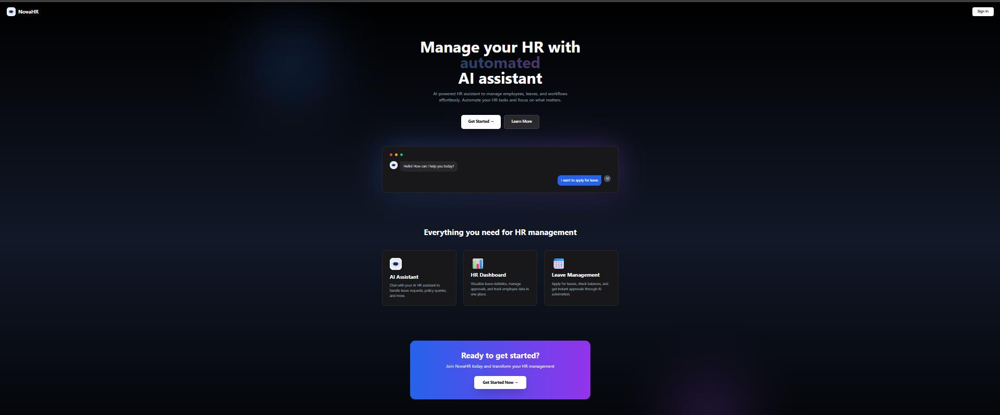
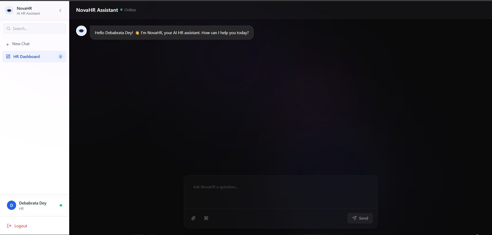

# NovaHR - AI-Powered HR Assistant
## UI Preview

<p align="center">
  
  
</p>

> Complete HR management system with AI chatbot, leave management, email automation, calendar scheduling, policy Q&A, and long-term memory.

---

## Quick Navigation

| Section | Description |
|---------|-------------|
| [Quick Start](#quick-start) | Get up and running in 10 minutes |
| [Features](#features) | What NovaHR can do |
| [Project Structure](#project-structure) | Folder layout |
| [Installation](#installation) | Full setup guide |
| [Running the App](#running-the-application) | Start backend and frontend |
| [Usage](#usage) | How to use the system |
| [API Endpoints](#api-endpoints) | All REST endpoints |
| [Architecture](#architecture) | System design and agent flow |
| [Memory System](#memory-system) | Long-term memory with ChromaDB |
| [Memory Cleanup](#memory-cleanup) | Automatic and manual cleanup |
| [LangSmith Tracing](#langsmith-tracing) | Agent observability |
| [Scripts](#scripts) | Utility scripts |
| [Security](#security) | Auth and access control |
| [Database Schema](#database-schema) | Tables and columns |
| [Tech Stack](#tech-stack) | Libraries and tools used |
| [Environment Variables](#environment-variables) | All `.env` keys |
| [Troubleshooting](#troubleshooting) | Common issues and fixes |

---

## Quick Start

```bash
# 1. Clone and enter project
git clone <your-repo-url>
cd NovaHR

# 2. Create virtual environment
python -m venv venv
venv\Scripts\activate        # Windows
# source venv/bin/activate   # Mac/Linux

# 3. Install dependencies
pip install -r requirements.txt

# 4. Configure environment
cp .env.example .env
# Edit .env with your keys (see Environment Variables section)

# 5. Setup database
python auth/setup_auth.py

# 6. Embed company policy
python src/tools/embed_policy.py

# 7. Start backend
python scripts/start_api.py

# 8. Start frontend (new terminal)
cd novahr-frontend
npm install
npm start
```

Open `http://localhost:3000` and login:
- **HR:** `debabratadey9090@gmail.com` / your password
- **Employee:** `sayandip05@gmail.com` / your password

---

## Features

### AI Assistant
- **Multi-Agent System** — LangGraph-powered routing to 5 specialized agents
- **Leave Management** — Apply for leave with natural language
- **Email Automation** — Compose and send emails via Gmail SMTP with smart recipient detection
- **Calendar Integration** — Schedule meetings with Google Calendar (HR only)
- **Policy Q&A** — ChromaDB vector search over company policy documents
- **Leave Balance Queries** — Real-time balance checks from MySQL
- **Long-term Memory** — Remembers important facts across sessions via ChromaDB
- **LangSmith Tracing** — Full observability of all agent executions

### HR Dashboard
- **Leave Request Management** — View all employee leave requests
- **Approve/Reject** — One-click approval/rejection with instant updates
- **Statistics** — Real-time counts (Total, Pending, Approved, Rejected) with bar chart
- **Filter by Status** — Filter leave requests by All, Pending, Approved, Rejected
- **Memory Management Panel** — HR-only section at the bottom of the dashboard to view all employees' stored memories, clear per-user memories, and run manual cleanup with a configurable day threshold

### Authentication and Security
- **JWT Token-based Auth** — Secure login with bcrypt password hashing
- **Role-based Access** — HR and Employee roles with different permissions
- **Session Management** — Stateful conversations with per-user sessions
- **Automatic Memory Cleanup** — TTL-based cleanup every 30 days via APScheduler

### REST API
- **FastAPI Backend** — Auto-generated Swagger docs at `/docs`
- **CORS Enabled** — Ready for frontend integration
- **Protected Endpoints** — JWT verification on all sensitive routes
- **Memory API** — Endpoints for memory stats and management

---

## Project Structure

```
NovaHR/
├── api/                              # FastAPI backend
│   ├── dependencies/
│   │   └── auth.py                  # JWT verification middleware
│   ├── routers/
│   │   ├── auth.py                  # Login endpoint
│   │   ├── chat.py                  # Chat endpoint + memory integration
│   │   ├── leaves.py                # Leave management (HR only)
│   │   └── memory.py                # Memory management API
│   ├── main.py                      # FastAPI app, CORS, APScheduler
│   └── models.py                    # Pydantic models (ChatRequest, ChatResponse, etc.)
│
├── auth/
│   ├── auth.py                      # Login logic + JWT creation
│   └── setup_auth.py                # Database setup script (adds password/auth_role columns)
│
├── src/
│   ├── config.py                        # Centralized config via pydantic-settings
│   ├── logger.py                        # Shared logging setup (get_logger)
│   ├── main_agent/
│   │   ├── agents/
│   │   │   ├── email/               # Email agent (yagmail, smart recipient detection)
│   │   │   ├── leave/               # Leave agent (multi-step workflow, non-LLM)
│   │   │   ├── query/               # Query agent (policy Q&A + leave balance)
│   │   │   ├── scheduling/          # Schedule agent (Google Calendar, HR only, IST-aware)
│   │   │   ├── employee/            # Employee portal agent
│   │   │   └── general/             # General conversation agent (uses long-term memory)
│   │   ├── memory.py                # ConversationBufferWindowMemory with summarization
│   │   └── router.py                # LangGraph StateGraph + intent routing
│   ├── tools/
│   │   ├── db_connection.py         # MySQL with tenacity retry + ping reconnect
│   │   └── embed_policy.py          # PDF embedder for policy documents into ChromaDB
│   └── utils/
│       ├── memory_store.py          # ChromaDB long-term memory (store, search, cleanup)
│       └── memory_filter.py         # LLM-based + keyword filtering for what to store
│
├── novahr-frontend/                 # React frontend
│   └── src/
│       ├── pages/
│       │   ├── Landing.jsx          # Animated public landing page
│       │   ├── Login.jsx            # Dark-themed auth form
│       │   ├── Chat.jsx             # ChatGPT-style AI assistant interface
│       │   ├── Dashboard.jsx        # HR leave management with charts
│       │   └── NotFound.jsx         # 404 page
│       ├── components/
│       │   └── ui/
│       │       ├── Button.jsx
│       │       ├── Card.jsx
│       │       ├── ChatBubble.jsx
│       │       ├── Input.jsx
│       │       └── LoadingSpinner.jsx
│       ├── services/
│       │   ├── authService.js       # Login, logout, getUser, getToken
│       │   ├── chatService.js       # sendMessage, clearSession
│       │   ├── leaveService.js      # getLeaves, getLeaveStats, approve, reject
│       │   └── memoryService.js     # getMemoryStats, getAllUsersMemories, cleanup
│       ├── config/
│       │   └── api.js               # Centralized API base URL
│       ├── utils/
│       │   └── session.js           # Session ID management (localStorage)
│       └── App.jsx                  # React Router setup + protected routes
│
├── scripts/
│   ├── start_api.py                 # Starts uvicorn server on port 8000
│   ├── add_employee.py              # Add employees or reset passwords (interactive CLI)
│   └── cleanup_memory.py            # Manual memory cleanup script
│
├── data/
│   ├── NovaHR_Company_Policy_Notebook.pdf
│   ├── chroma_db/                   # Policy vector database
│   └── long_term_memory/            # Long-term memory vector database
│
├── tests/
│   ├── conftest.py                  # Shared pytest fixtures (DB, tokens, client)
│   ├── test_auth.py                 # Authentication tests
│   ├── test_leave_agent.py          # Leave agent + date parsing tests
│   ├── test_email_agent.py          # Email agent + recipient parsing tests
│   ├── test_query_agent.py          # Policy Q&A + leave balance tests
│   ├── test_scheduling_agent.py     # Scheduling agent + IST datetime tests
│   ├── test_memory.py               # Memory filter + ChromaDB store tests
│   ├── test_api_endpoints.py        # FastAPI endpoint integration tests
│   ├── test_router.py               # Intent routing tests (all 22 cases)
│   └── test_connections.py          # Basic connection checks
│
├── pytest.ini                       # Pytest configuration
│
├── .env                             # Environment variables (not committed)
├── .env.example                     # Environment variable template
├── requirements.txt                 # Python dependencies
└── Credentials.json                 # Google Calendar OAuth credentials
```

---

## Installation

### Prerequisites
- Python 3.9+
- Node.js 18+
- MySQL 8.0+
- Gmail account with App Password (for email features)
- Google Cloud project with Calendar API enabled (for scheduling features)

### 1. Clone Repository
```bash
git clone <your-repo-url>
cd NovaHR
```

### 2. Backend Setup

#### Install Python Dependencies
```bash
python -m venv venv
venv\Scripts\activate        # Windows
# source venv/bin/activate   # Mac/Linux
pip install -r requirements.txt
```

#### Configure Environment Variables
Create `.env` file (or copy from `.env.example`):
```env
# LLM API
GROQ_API_KEY=your_groq_api_key

# Email (Gmail)
EMAIL_ADDRESS=your_email@gmail.com
EMAIL_APP_PASSWORD=your_app_password

# MySQL Database
DB_HOST=localhost
DB_USER=root
DB_PASSWORD=your_password
DB_NAME=novahr

# JWT Secret (use a strong random string)
SECRET_KEY=your_super_secret_key_here

# LangSmith (optional - for agent tracing)
LANGCHAIN_API_KEY=your_langsmith_key
LANGCHAIN_TRACING_V2=true
LANGCHAIN_PROJECT=novahr
LANGCHAIN_ENDPOINT=https://api.smith.langchain.com
```

Generate a secure SECRET_KEY:
```python
import secrets; print(secrets.token_urlsafe(32))
```

#### Setup MySQL Database
```sql
CREATE DATABASE novahr;
USE novahr;

CREATE TABLE employees (
    id INT PRIMARY KEY AUTO_INCREMENT,
    name VARCHAR(100),
    email VARCHAR(100) UNIQUE,
    department VARCHAR(100),
    password VARCHAR(255),
    auth_role VARCHAR(20)
);

CREATE TABLE leaves (
    leave_id INT PRIMARY KEY AUTO_INCREMENT,
    employee_id INT,
    leave_type VARCHAR(10),
    start_date DATE,
    end_date DATE,
    days INT,
    status VARCHAR(20) DEFAULT 'pending',
    reason TEXT,
    submitted_at TIMESTAMP DEFAULT CURRENT_TIMESTAMP,
    FOREIGN KEY (employee_id) REFERENCES employees(id)
);

-- Insert initial employees
INSERT INTO employees (name, email, department) VALUES
('Debabrata Dey', 'debabratadey9090@gmail.com', 'HR'),
('Sayandip Bar', 'sayandip05@gmail.com', 'Finance');
```

#### Setup Authentication (hashes passwords + sets roles)
```bash
python auth/setup_auth.py
```

Default credentials after setup:
- HR (first employee): `debabratadey9090@gmail.com` — password set via `scripts/add_employee.py`
- Employee (all others): `sayandip05@gmail.com` — password set via `scripts/add_employee.py`

> To reset any password: `python scripts/add_employee.py` → option 2

#### Embed Company Policy into ChromaDB
```bash
python src/tools/embed_policy.py
```

### 3. Frontend Setup
```bash
cd novahr-frontend
npm install
```

---

## Running the Application

### Start Backend (Terminal 1)
```bash
python scripts/start_api.py
```
- API: `http://localhost:8000`
- Swagger docs: `http://localhost:8000/docs`
- On startup: `[SCHEDULER] Automatic memory cleanup enabled (runs daily at 2 AM)`

### Start Frontend (Terminal 2)
```bash
cd novahr-frontend
npm start
```
- Frontend: `http://localhost:3000`

---

## Usage

### Web Interface

#### User Flow
1. Visit `http://localhost:3000` — animated landing page
2. Click **Get Started** or **Sign In** — goes to login
3. Login — redirects to Chat
4. HR users can navigate to the Dashboard from the chat sidebar

#### Login
- **HR:** `debabratadey9090@gmail.com` (Debabrata Dey)
- **Employee:** `sayandip05@gmail.com` (Sayandip Bar)

#### Chat with AI Assistant
- Check balance: *"What is my leave balance?"*
- Apply for leave: *"I want to apply for leave"*
- Check status: *"Is my leave approved?"*
- Policy questions: *"What is the casual leave policy?"*
- Send email: *"Send email to all HR employees"*
- Schedule meeting (HR only): *"Schedule a meeting tomorrow at 3pm"*
- The agent remembers important facts across sessions via long-term memory

#### HR Dashboard
- Navigate to `http://localhost:3000/dashboard`
- View all leave requests with employee details
- Approve or reject with one click
- Filter by status: All, Pending, Approved, Rejected
- Bar chart visualization of leave statistics

---

## API Endpoints

### Authentication
| Method | Endpoint | Auth | Description |
|--------|----------|------|-------------|
| `POST` | `/api/auth/login` | No | Login and get JWT token |

### Chat
| Method | Endpoint | Auth | Description |
|--------|----------|------|-------------|
| `POST` | `/api/chat` | Yes | Send message to AI agent |
| `GET` | `/api/chat/session/{id}` | Yes | Get session info |
| `DELETE` | `/api/chat/session/{id}` | Yes | Clear session |
| `GET` | `/api/chat/sessions` | Yes | List all active sessions |

### Leave Management (HR Only)
| Method | Endpoint | Auth | Role | Description |
|--------|----------|------|------|-------------|
| `GET` | `/api/leaves` | Yes | HR | Get all leave requests |
| `GET` | `/api/leaves/stats` | Yes | HR | Get leave statistics |
| `PUT` | `/api/leaves/{id}/approve` | Yes | HR | Approve a leave request |
| `PUT` | `/api/leaves/{id}/reject` | Yes | HR | Reject a leave request |

### Memory Management
| Method | Endpoint | Auth | Role | Description |
|--------|----------|------|------|-------------|
| `GET` | `/api/memory/stats` | Yes | Any | Get total memory count |
| `GET` | `/api/memory/user` | Yes | Any | Get current user's memories |
| `GET` | `/api/memory/all` | Yes | HR | Get all users' memories (grouped by user) |
| `DELETE` | `/api/memory/user` | Yes | Any | Clear current user's memories |
| `DELETE` | `/api/memory/user/{user_id}` | Yes | HR | Clear a specific user's memories |
| `POST` | `/api/memory/cleanup` | Yes | HR | Cleanup old memories (custom days) |
| `POST` | `/api/memory/cleanup/trigger` | Yes | HR | Trigger immediate cleanup (30 days) |

Full interactive docs: `http://localhost:8000/docs`

---

## Architecture

### Request Flow
```
User (Browser)
    |
    v
React Frontend (Landing / Login / Chat / Dashboard)
    |  HTTP + Bearer JWT
    v
FastAPI (api/main.py)
    |
    v
JWT Verification (api/dependencies/auth.py)
    |
    v
Chat Router (api/routers/chat.py)
    |
    +-- Search long-term memory (ChromaDB)
    |
    v
LangGraph Agent Pipeline (src/main_agent/router.py)
    |
    +-- Intent Detection (rule-based, no LLM)
    |
    +-------+----------+-----------+----------+----------+
    |       |          |           |          |          |
    v       v          v           v          v          v
  Leave   Email     Query      Schedule   General   Employee
  Agent   Agent     Agent       Agent      Agent     Agent
    |       |          |           |          |
    v       v          v           v          v
  MySQL  Gmail      ChromaDB   Google     Groq LLM
         SMTP       + MySQL    Calendar
    |
    v
Filter + Store important info (memory_filter + memory_store)
    |
    v
Response to Frontend
```

### Agent Routing (Intent Detection Priority)
```
User Message
    |
    v
1. Schedule Agent -- "schedule a meeting", "book a meeting", "set up a meeting" (HR only)
2. Email Agent    -- "send an email", "send email to", "write an email"
3. Leave Agent    -- "apply for leave", "request leave", "take leave", "want leave"
4. Query Agent    -- leave balance, leave status, policy questions
5. General Agent  -- everything else (conversation, questions about past events)
```

### Email Agent — Recipient Detection Priority
```
1. Department-based  -- "all HR employees", "engineering department"
2. All employees     -- "all employees", "everyone", "everybody"
3. Email addresses   -- regex extraction from message
4. Employee names    -- case-insensitive partial DB lookup
5. Multiple          -- "send to Sayandip and Debabrata"
```

---

## Memory System

NovaHR uses two types of memory working together:

### Short-term Memory (Per Session)
- **Type:** `ConversationBufferWindowMemory` (LangChain)
- **Storage:** In-memory (RAM)
- **Scope:** Current conversation only
- **Window:** Last 5–10 messages per agent
- **Persistence:** Lost when session ends or server restarts
- **Purpose:** Maintain conversation context within a chat

### Long-term Memory (Across Sessions)
- **Type:** ChromaDB vector embeddings
- **Storage:** Persistent disk (`data/long_term_memory/`)
- **Scope:** All conversations per user
- **Persistence:** Survives server restarts
- **Purpose:** Remember important facts across sessions

### How Long-term Memory Works

```
User sends message
    |
    v
1. Search ChromaDB for relevant past memories (top 3, cosine similarity)
    |
    v
2. Inject memories into agent state: state["long_term_memory"]
    |
    v
3. Agent processes message with memory context
    |
    v
4. Filter: Is this message/response important enough to store?
    |
    v
5. Store important info in ChromaDB with metadata (user_id, intent, timestamp)
    |
    v
Return personalized response
```

### What Gets Stored

| Category | Trigger Keywords | Example |
|----------|-----------------|---------|
| Personal Info | "my name is", "i am", "i work in" | "My name is Debu" |
| Leave Details | "leave", "vacation", "sick" | "I need leave from May 10-12" |
| Work Info | "project", "deadline", "meeting" | "Working on the API project" |
| Preferences | "prefer", "usually", "always" | "I usually take leave on Fridays" |
| Important Facts | "remember", "important", "note" | "Remember I have a doctor appointment" |
| Completions | step == "completed" | "Leave successfully submitted" |

### What Gets Excluded
- Trivial responses: "ok", "yes", "thanks", "bye"
- Very short messages (under 5 characters)
- Generic questions without personal context

### Memory in Action

**Session 1:**
```
User: "My name is Debu and I work in Engineering"
Agent: "Nice to meet you, Debu!"
→ Stored in ChromaDB
```

**Session 2 (days later):**
```
User: "Who am I?"
→ ChromaDB retrieves: "My name is Debu and I work in Engineering"
Agent: "You're Debu from the Engineering department!"
```

### Technical Specs
- **Embedding Model:** `sentence-transformers/all-MiniLM-L6-v2` (384 dimensions)
- **Search Algorithm:** HNSW (Hierarchical Navigable Small World)
- **Similarity Metric:** Cosine similarity
- **Results per Query:** Top 3 most relevant memories
- **Storage Location:** `data/long_term_memory/`

### Key Files
| File | Purpose |
|------|---------|
| `src/utils/memory_store.py` | ChromaDB storage, retrieval, cleanup |
| `src/utils/memory_filter.py` | LLM-based + keyword filtering |
| `api/routers/chat.py` | Memory integration in chat endpoint |
| `src/main_agent/agents/general/executor.py` | Uses memories in prompts |
| `src/main_agent/router.py` | `long_term_memory` field in State |

---

## Memory Cleanup

### Automatic Cleanup (Zero Effort)

Runs automatically every day at 2 AM when the server is running:

```bash
python scripts/start_api.py
# Output: [SCHEDULER] Automatic memory cleanup enabled (runs daily at 2 AM)
```

Deletes memories older than 30 days for all users.

### Manual Cleanup Options

#### Option 1: HR Dashboard UI
Navigate to `http://localhost:3000/dashboard` → scroll to the **Memory Management** section at the bottom.
- Set the number of days in the input field (`0` = delete all memories)
- Click **Run Cleanup**
- The panel also shows all stored memories per employee and lets you clear individual users

#### Option 2: API (Swagger UI)
```
POST /api/memory/cleanup/trigger
```
Response:
```json
{
  "message": "Cleanup triggered successfully",
  "days": 30,
  "memories_before": 150,
  "memories_after": 120,
  "deleted": 30
}
```

#### Option 3: Custom days via API
```
POST /api/memory/cleanup
Body: { "days": 60 }
```
Use `days: 0` to delete all memories regardless of age.

#### Option 4: Command Line Script
```bash
# Delete memories older than 30 days (default)
python scripts/cleanup_memory.py

# Delete memories older than 60 days
python scripts/cleanup_memory.py --days 60
```

### Cleanup Day Threshold Behaviour
| Value | Effect |
|-------|--------|
| `0` | Delete all memories |
| `1` | Delete anything before today (midnight) |
| `7` | Delete anything older than 7 days |
| `30` | Delete anything older than 30 days (default) |

### Change Cleanup Schedule
Edit `api/main.py`:
```python
# Daily at 2 AM (default)
scheduler.add_job(cleanup_old_memories_job, trigger='cron', hour=2, minute=0)

# Every 12 hours
scheduler.add_job(cleanup_old_memories_job, trigger='interval', hours=12)

# Weekly on Sunday at 3 AM
scheduler.add_job(cleanup_old_memories_job, trigger='cron', day_of_week='sun', hour=3)
```

### Check Memory Stats
```
GET /api/memory/stats
```
```json
{
  "total_memories": 120,
  "collection_name": "novahr_long_term_memory"
}
```

---

## LangSmith Tracing

All agents have `@traceable` decorator for full observability:

| Agent | File |
|-------|------|
| Router | `src/main_agent/router.py` |
| Leave Agent | `src/main_agent/agents/leave/executor.py` |
| Email Agent | `src/main_agent/agents/email/executor.py` |
| Query Agent | `src/main_agent/agents/query/executor.py` |
| Schedule Agent | `src/main_agent/agents/scheduling/executor.py` |
| General Agent | `src/main_agent/agents/general/executor.py` |

### Enable Tracing
Add to `.env`:
```env
LANGCHAIN_API_KEY=your_langsmith_key
LANGCHAIN_TRACING_V2=true
LANGCHAIN_PROJECT=novahr
LANGCHAIN_ENDPOINT=https://api.smith.langchain.com
```

View traces at `https://smith.langchain.com/` under project `novahr`.

---

## Scripts

All scripts live in the `scripts/` folder and must be run from the project root.

### Start API Server
```bash
python scripts/start_api.py
```
Starts uvicorn on `http://localhost:8000` with hot-reload enabled.

### Employee Management
```bash
python scripts/add_employee.py
```
Interactive CLI with two options:

**1. Add new employee**
- Prompts for name, email, department, role (EMPLOYEE/HR), password
- Validates email uniqueness
- Hashes password with bcrypt (10 rounds)

**2. Reset employee password**
- Search by name (partial match) or email (exact match)
- Handles multiple matches with a selection list
- Confirms before updating

### Memory Cleanup
```bash
# Default: delete memories older than 30 days
python scripts/cleanup_memory.py

# Custom threshold
python scripts/cleanup_memory.py --days 60
```

### Run Tests
```bash
# Run full test suite (134 tests)
python -m pytest tests/ -v

# Run a specific test file
python -m pytest tests/test_auth.py -v

# Run with short output
python -m pytest tests/ --tb=short
```

---

## Security

- **Passwords:** bcrypt hashed (cost factor 10)
- **JWT Tokens:** HS256 algorithm, 8-hour expiry
- **Role-based Access:** HR vs Employee permissions enforced at API level
- **CORS:** Currently `allow_origins=["*"]` — restrict to specific origins in production
- **Environment Variables:** Sensitive data in `.env` (not committed to git)

> **Production note:** Before deploying, update CORS in `api/main.py`:
> ```python
> allow_origins=["https://your-frontend-domain.com"]
> ```

---

## Database Schema

### `employees` Table
| Column | Type | Description |
|--------|------|-------------|
| `id` | INT (PK, AUTO_INCREMENT) | Employee ID |
| `name` | VARCHAR(100) | Full name |
| `email` | VARCHAR(100) UNIQUE | Login email |
| `department` | VARCHAR(100) | Department name |
| `password` | VARCHAR(255) | bcrypt hashed password |
| `auth_role` | VARCHAR(20) | `HR` or `EMPLOYEE` |

### `leaves` Table
| Column | Type | Description |
|--------|------|-------------|
| `leave_id` | INT (PK, AUTO_INCREMENT) | Leave request ID |
| `employee_id` | INT (FK) | References `employees.id` |
| `leave_type` | VARCHAR(10) | `EL`, `CL`, or `SL` |
| `start_date` | DATE | Leave start date |
| `end_date` | DATE | Leave end date |
| `days` | INT | Number of days |
| `status` | VARCHAR(20) | `pending`, `approved`, `rejected` |
| `reason` | TEXT | Reason for leave |
| `submitted_at` | TIMESTAMP | Submission timestamp |

### Leave Policy
| Type | Full Name | Days/Year |
|------|-----------|-----------|
| `EL` | Earned Leave | 18 |
| `CL` | Casual Leave | 12 |
| `SL` | Sick Leave | 12 |

Leave balance counts both `approved` and `pending` leaves as used. Only `rejected` leaves are excluded.

---

## Tech Stack

### Backend
| Tool | Version | Purpose |
|------|---------|---------|
| FastAPI | 0.128.5 | REST API framework |
| Uvicorn | 0.40.0 | ASGI server |
| LangGraph | 1.1.6 | Agent pipeline and routing |
| LangChain | 1.2.15 | Agent memory and tools |
| Groq (Llama 3.3-70b) | 0.37.1 | LLM for agent reasoning |
| ChromaDB | 1.4.1 | Vector DB (policy + long-term memory) |
| Sentence Transformers | 5.2.2 | Text embeddings (all-MiniLM-L6-v2) |
| MySQL Connector | 9.6.0 | Employee and leave data |
| APScheduler | 3.11.2 | Automatic memory cleanup |
| python-jose + bcrypt | 3.5.0 / 5.0.0 | JWT auth + password hashing |
| LangSmith | 0.6.7 | Agent tracing and observability |
| google-api-python-client | 2.193.0 | Google Calendar integration |
| pypdf | 6.6.0 | PDF policy document processing |
| pydantic-settings | 2.9.1 | Centralized config with validation |
| tenacity | 9.1.2 | Retry logic for DB queries |
| yagmail | 0.15.293 | Simplified Gmail sending |
| python-dateutil | 2.9.0 | Flexible date parsing in leave agent |

### Frontend
| Tool | Version | Purpose |
|------|---------|---------|
| React | 19.2.5 | UI framework |
| React Router DOM | 7.14.2 | Client-side routing |
| Tailwind CSS | 3.4.1 | Utility-first styling |
| Framer Motion | 12.38.0 | Animations and transitions |
| Recharts | 3.8.1 | Bar charts on HR dashboard |
| Lucide React | 1.14.0 | Icon library |
| clsx | 2.1.1 | Conditional class names |

### Integrations
- **Email:** Gmail SMTP (via `EMAIL_ADDRESS` + `EMAIL_APP_PASSWORD`)
- **Calendar:** Google Calendar API (via `Credentials.json` OAuth)

### Testing
| Tool | Version | Purpose |
|------|---------|---------|
| pytest | 8.4.2 | Test runner (134 tests) |
| pytest-asyncio | 0.24.0 | Async test support |
| httpx | 0.28.1 | FastAPI TestClient HTTP layer |

---

## Environment Variables

All environment variables are validated at startup via `pydantic-settings` (`src/config.py`). Missing required values raise a clear error immediately rather than failing silently later.

| Variable | Required | Default | Description |
|----------|----------|---------|-------------|
| `GROQ_API_KEY` | Yes | — | Groq API key for LLM (Llama 3.3-70b) |
| `EMAIL_ADDRESS` | No | `""` | Gmail address for sending emails |
| `EMAIL_APP_PASSWORD` | No | `""` | Gmail App Password (not your account password) |
| `DB_HOST` | No | `localhost` | MySQL host |
| `DB_USER` | No | `root` | MySQL username |
| `DB_PASSWORD` | No | `""` | MySQL password |
| `DB_NAME` | No | `novahr` | MySQL database name |
| `SECRET_KEY` | No | `dev_secret_change_in_production` | JWT signing secret — **change this in production** |
| `LANGCHAIN_API_KEY` | No | `""` | LangSmith API key for tracing |
| `LANGCHAIN_TRACING_V2` | No | `false` | Enable LangSmith tracing (`true`/`false`) |
| `LANGCHAIN_PROJECT` | No | `novahr` | LangSmith project name |
| `LANGCHAIN_ENDPOINT` | No | `https://api.smith.langchain.com` | LangSmith endpoint URL |

---

## Troubleshooting

### Backend won't start
- Check if port 8000 is in use: `netstat -ano | findstr :8000`
- Verify `.env` exists with all required variables — `GROQ_API_KEY` is the only truly required one; missing it raises a `ValidationError` at startup
- Ensure MySQL is running and credentials are correct
- Make sure you run from the project root: `python scripts/start_api.py`

### Frontend can't connect to backend
- Verify backend is running at `http://localhost:8000`
- Check browser console (F12) for CORS errors
- Clear localStorage: open console and run `localStorage.clear()`

### Token expired / 401 errors
- JWT tokens expire after 8 hours
- Logout and login again to get a fresh token

### Dashboard shows no data
- Ensure you're logged in as an HR user (`debabratadey9090@gmail.com`)
- Verify the backend is running
- Check browser console for errors
- Test the API directly in Swagger UI at `http://localhost:8000/docs`

Quick browser console test:
```javascript
// Login and get token
fetch('http://localhost:8000/api/auth/login', {
  method: 'POST',
  headers: {'Content-Type': 'application/json'},
  body: JSON.stringify({ email: 'debabratadey9090@gmail.com', password: 'your_password' })
}).then(r => r.json()).then(d => {
  localStorage.setItem('token', d.token);
  localStorage.setItem('user', JSON.stringify(d.user));
  console.log('Role:', d.user.auth_role);
});

// Fetch leaves (run after login)
fetch('http://localhost:8000/api/leaves', {
  headers: { 'Authorization': `Bearer ${localStorage.getItem('token')}` }
}).then(r => r.json()).then(d => console.log('Leaves:', d));
```

### Memory not persisting
- Check that `data/long_term_memory/` directory exists
- Verify the message matches filter keywords (see Memory System section)
- Check API logs for ChromaDB errors

### Reset ChromaDB memory
```python
import shutil
shutil.rmtree("data/long_term_memory")
# Restart: python scripts/start_api.py
```

### Email not sending
- Verify `EMAIL_ADDRESS` and `EMAIL_APP_PASSWORD` in `.env`
- Use a Gmail App Password, not your regular Gmail password
- Enable 2FA on your Google account first, then generate an App Password at myaccount.google.com/apppasswords
- The project uses `yagmail` — if you see a keyring error on first run, set the password directly in `.env` (already the default behaviour)

### Google Calendar not working
- Ensure `Credentials.json` exists in the project root
- Verify the Google Calendar API is enabled in your Google Cloud project
- Re-run OAuth flow if credentials have expired
- All events are created in **Asia/Kolkata (IST)** timezone — make sure your Google Calendar display timezone is also set to IST

---

## License

MIT License — free to use for personal or commercial projects.

---

## Links

- **API Documentation:** `http://localhost:8000/docs`
- **Frontend:** `http://localhost:3000`
- **Dashboard:** `http://localhost:3000/dashboard` (HR only)
- **LangSmith:** `https://smith.langchain.com/`
